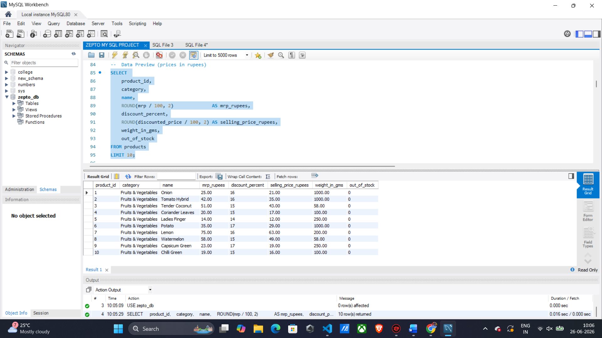
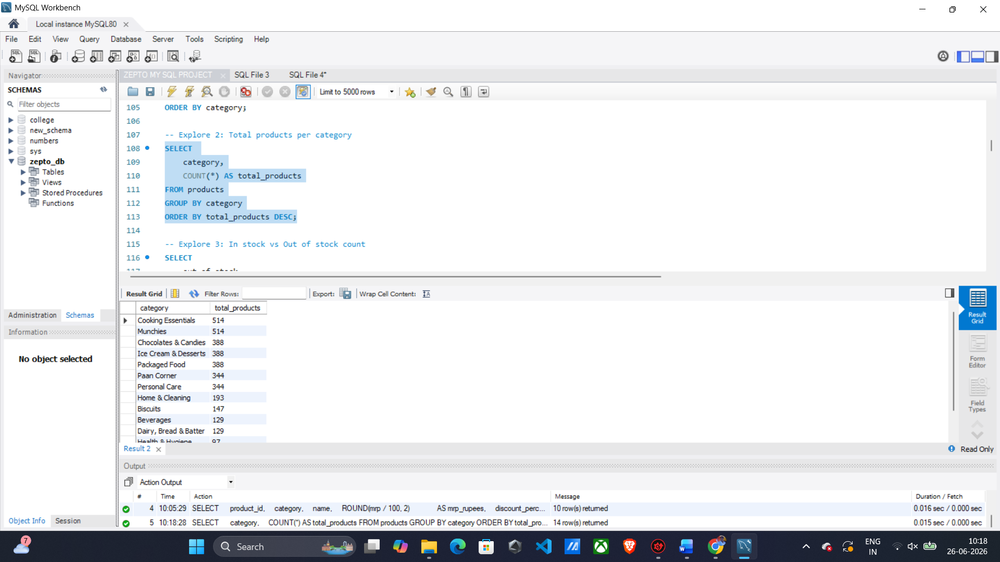
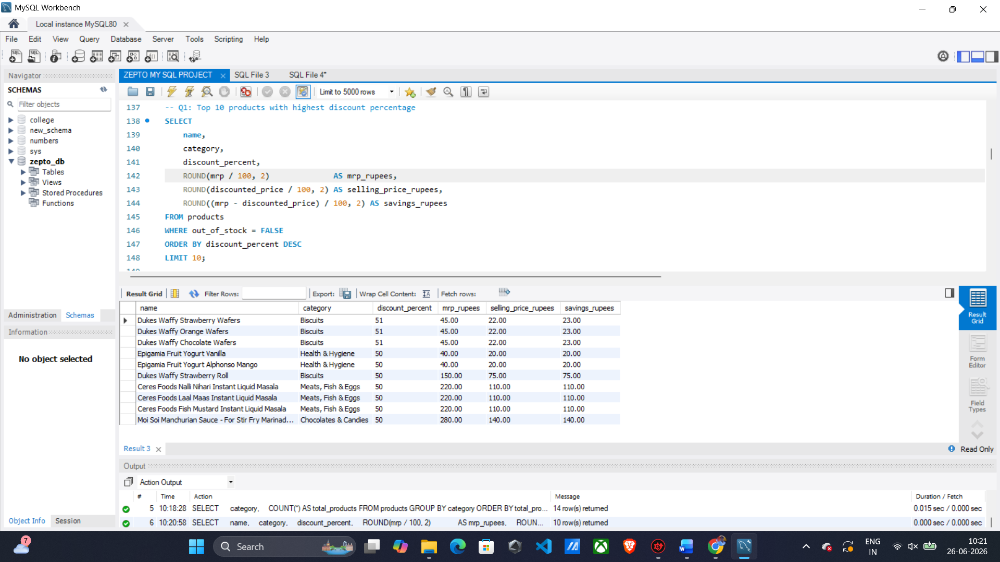
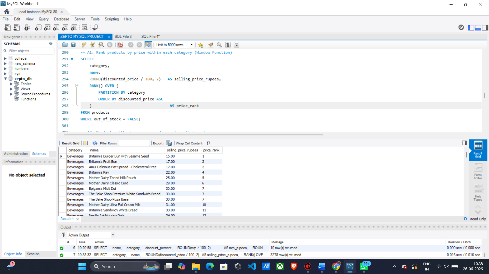
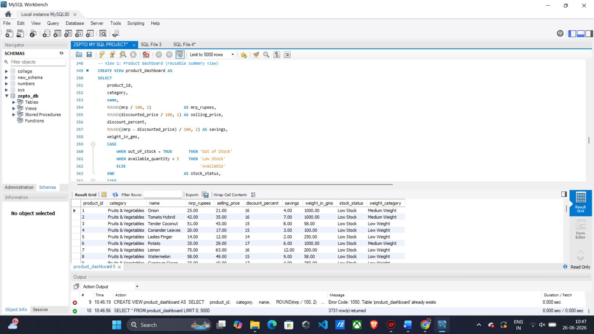
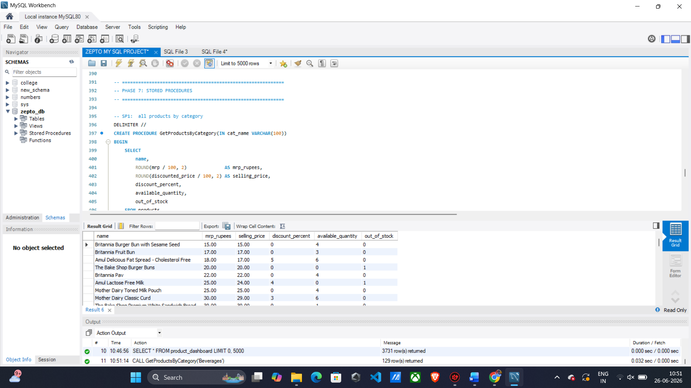
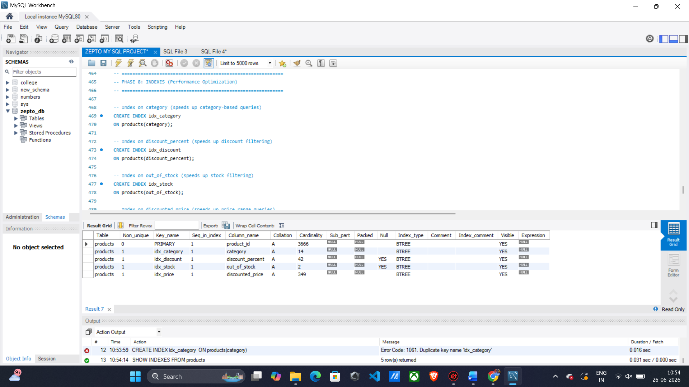
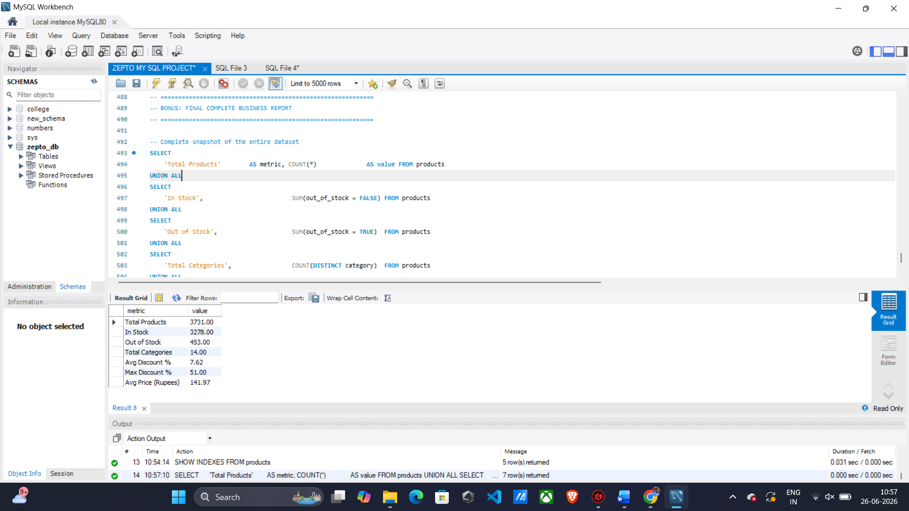

# 🛒 Zepto SQL Business Analysis Project


---

# 📌 Project Overview

This project performs an end-to-end SQL-based business analysis on the **Zepto grocery products dataset**.

The objective is to transform raw product data into meaningful business insights using SQL. The project demonstrates practical SQL skills used by Data Analysts, including data cleaning, business reporting, window functions, views, stored procedures, indexing, and analytical queries.

---

# 🎯 Objectives

- Clean and prepare raw product data
- Perform exploratory data analysis
- Generate business insights
- Build reusable SQL views
- Optimize query performance using indexes
- Demonstrate advanced SQL concepts

---

# 🗂 Dataset Information

- **Dataset:** Zepto Grocery Products
- **Database:** MySQL
- **Total Products:** 3731
- **Categories:** 14

---

# 🛠 Technologies Used

- MySQL
- MySQL Workbench
- SQL
- Git
- GitHub

---

# 📚 SQL Concepts Used

- SELECT
- WHERE
- GROUP BY
- ORDER BY
- HAVING
- Aggregate Functions
- CASE Statements
- Window Functions
- Views
- Stored Procedures
- Indexes
- Subqueries
- UNION ALL

---

# 📈 Business Questions Solved

✔ Which categories contain the most products?

✔ Which products offer the highest discounts?

✔ Which products have the highest MRP?

✔ Which products are currently out of stock?

✔ What is the average selling price by category?

✔ Which categories generate premium-priced products?

✔ What is the overall inventory summary?

---

# 📷 Project Screenshots

## Dataset Preview

Shows the cleaned Zepto product dataset.



---

## Category Analysis

Category-wise product distribution.



---

## Top Discount Products

Products providing the maximum discounts.



---

## Window Function

Ranking products using SQL Window Functions.



---

## Product Dashboard View

Reusable SQL View created for business reporting.



---

## Stored Procedure

Reusable stored procedure for business analysis.



---

## Index Creation

Performance optimization using SQL Indexes.



---

## Final Business Report

Overall business summary generated using SQL.



---

# 📊 Key Business Insights

- Total Products: **3731**
- Total Categories: **14**
- Products In Stock: **3278**
- Products Out of Stock: **453**
- Average Discount: **7.62%**
- Maximum Discount: **51%**
- Average Product Price: **₹141.97**

---

# 🚀 Skills Demonstrated

- SQL Data Cleaning
- Exploratory Data Analysis
- Business Reporting
- Window Functions
- Views
- Stored Procedures
- Query Optimization
- Analytical Thinking
- Data Visualization Preparation
- Business Intelligence

---

# 📁 Project Structure

```
Zepto_SQL_Project/
│
├── ZEPTO MY SQL PROJECT.sql
├── README.md
└── images/
    ├── dataset_preview.png
    ├── category_analysis.png
    ├── top_discount_products.png
    ├── window_function.png
    ├── view_creation.png
    ├── stored_procedure.png
    ├── index_creation.png
    └── final_output.png
```

---

# ⭐ Learning Outcomes

This project strengthened my understanding of:

- SQL Query Writing
- Business Data Analysis
- Window Functions
- Database Objects
- Query Optimisation
- Professional GitHub Documentation

---

# 👨‍💻 Author

**Saurav Sah**

Aspiring Data Analyst

GitHub: https://github.com/sauravanalytics

---

## ⭐ If you found this project useful, consider giving it a star!
